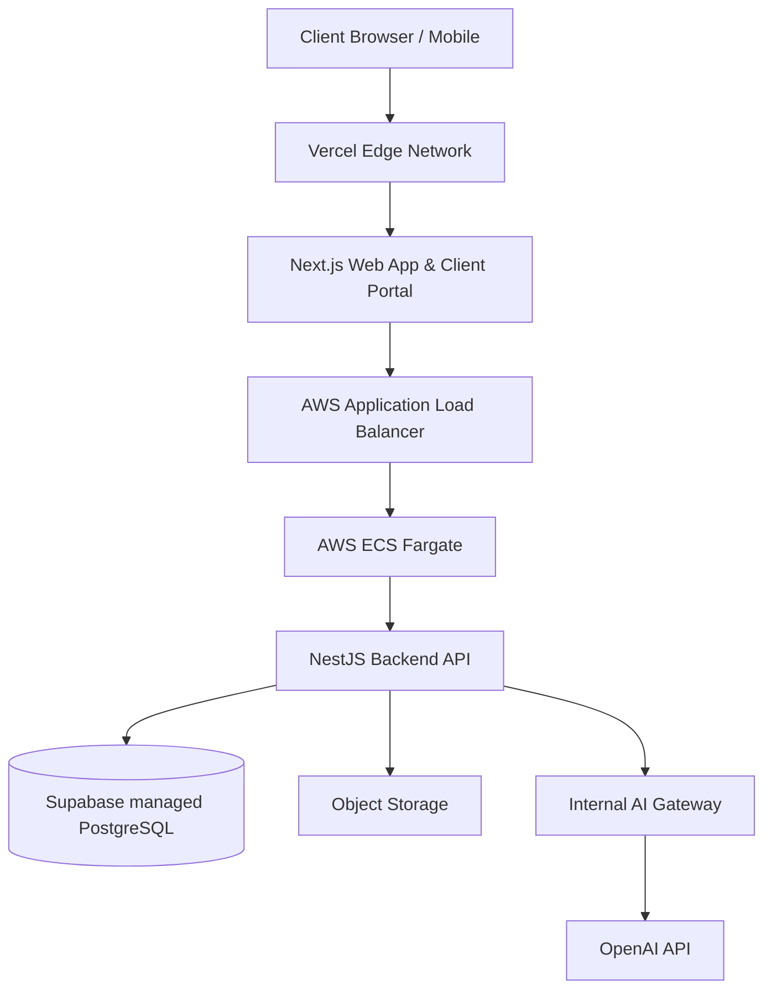

# NextHere Enterprise Platform - System Design

## 1. System Architecture
The platform is built as a Modular Monolith with clear domain boundaries, designed for future scalability without premature complexity.



## 2. Monorepo Structure
We utilize `pnpm` workspaces and Turborepo.

```text
nexthere/
├── apps/
│   ├── web/              # Next.js public website & Client portal (React, Tailwind)
│   ├── api/              # NestJS backend (REST, WebSockets)
│   └── admin/            # (Future) Dedicated admin dashboard
├── packages/
│   ├── ui/               # Shared React UI components (Shadcn/Tailwind)
│   ├── config/           # Shared ESLint, TSConfig, Prettier
│   ├── types/            # Shared TS types and DTOs
│   ├── database/         # Prisma/Drizzle schema and DB client
│   ├── auth/             # Shared Auth utilities
│   ├── ai/               # AI Gateway abstraction layer
│   └── integrations/     # 3rd party integrations (AWS, etc.)
├── infrastructure/
│   ├── docker/           # Dockerfiles for apps/api
│   └── aws/              # Infrastructure as Code (e.g., Terraform)
├── docs/                 # System documentation
├── package.json          # Root workspace definition
├── pnpm-workspace.yaml   # pnpm workspace config
└── turbo.json            # Turborepo pipeline config
```

## 7. Deployment Architecture
*   **Frontend**: Next.js deployed on Vercel.
*   **Backend**: NestJS containerized via Docker and deployed to AWS ECS Fargate, sitting behind an Application Load Balancer.
*   **Database**: Managed PostgreSQL via Supabase.
*   **CI/CD**: GitHub Actions.
    *   *PR*: Lint, Typecheck, Unit Tests.
    *   *Main branch*: Build Docker image, push to ECR, deploy to Staging.
    *   *Release*: Manual approval -> Deploy to Production ECS cluster.

## 8. Security Model
*   **Network**: HTTPS everywhere. Strict CORS policies on the NestJS API. DB access restricted to backend IP (VPC) / Supabase secure connection.
*   **Secrets**: AWS Secrets Manager / Vercel Secrets. No secrets committed to source. `.env.example` provided.
*   **App Security**: Input validation via Zod/Class-validator. Output sanitization. Helmet for HTTP headers. Rate Limiting enabled on API.
*   **Data Security**: Row Level Security (RLS) in PostgreSQL. Data encryption at rest and in transit.

## 9. MVP Implementation Plan (Phase 1)
1.  **Repository Setup**: Initialize pnpm workspace, Turborepo, Next.js (apps/web), and NestJS (apps/api).
2.  **Shared Packages**: Setup `packages/config`, `packages/ui` (Tailwind + Shadcn), and `packages/database` (Prisma/Drizzle + Supabase connection).
3.  **Frontend Foundation**: Build layout, navigation, and static pages (Home, About, Contact). Implement Three.js hero section.
4.  **Backend Foundation**: Setup NestJS modules (Auth, Services, Leads).
5.  **AI Advisor V1**: Implement the AI Gateway connecting to OpenAI for basic RAG-based Q&A.
6.  **Admin / Lead Gen**: Lead generation forms on Frontend connecting to Backend. Basic Admin API to view leads.
7.  **Deployment**: Setup Dockerfile, GitHub Actions, and initial deploy to Vercel/AWS ECS.
Updated for Phase 1B with Prisma ORM and API Endpoints  
